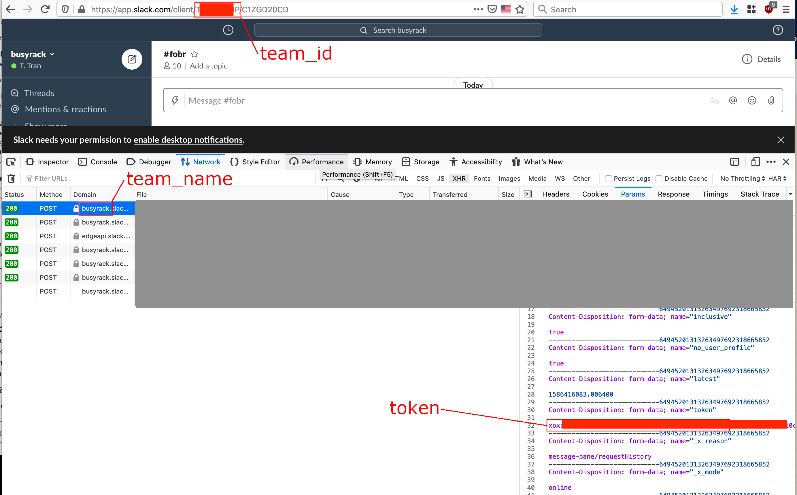
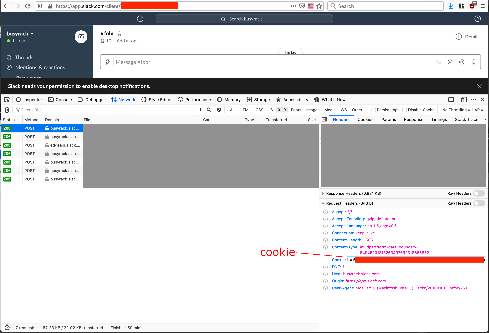

# slack-chat-backup
Backup your Slack chat messages (direct messages, group messages, joined channels) to your local computer without any extra permissions or apps.

# REQUIREMENTS

* BASH (`/bin/bash`)
* jq
* GNU's date and name it `gdate`
  - Linux: `alias gdate=date`
  - MacOS: `brew install coreutils`

# INSTALLATION

```
git clone https://github.com/t-tran/slack-chat-backup.git
```

# CONFIGURATION

By default, the program uses config file named `config.sh` in the program directory. There is a sample config file named `config_sample.sh`. You must fill `config.sh` file with proper settings for the program to work by following the steps below:

1. Login to your Slack workspace on your browser.

2. Enable `Web Developer >> Network` tool and refresh the workspace.

3. Copy the values for needed settings from browser to `config.sh` file.




# USAGE

```
./run.sh
```

# HOW IT WORKS

The program uses provided Slack cookie and token and other variables to connect directly to Slack servers, retrieve chat messages and store in local directory in JSON format.
